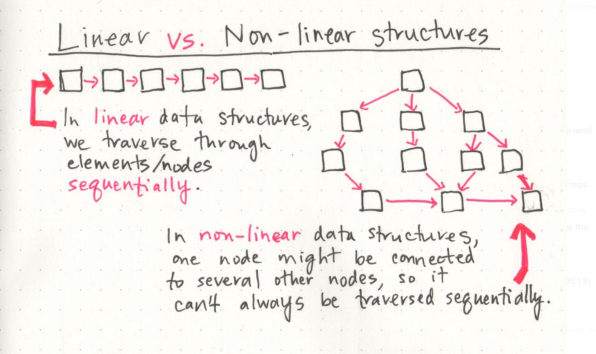
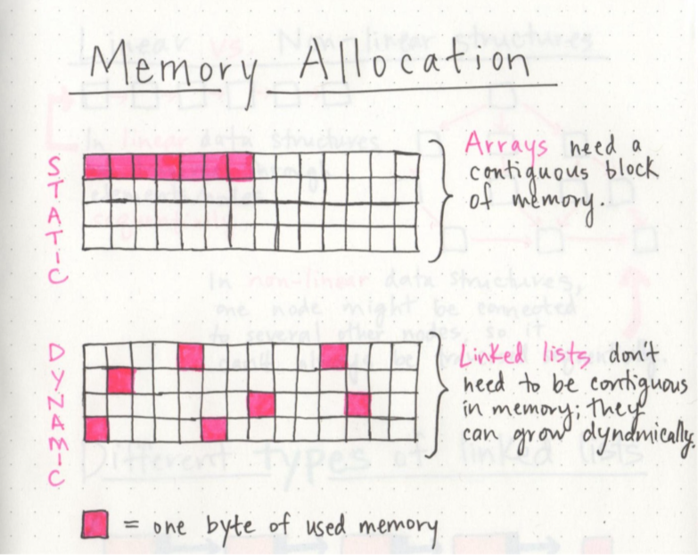
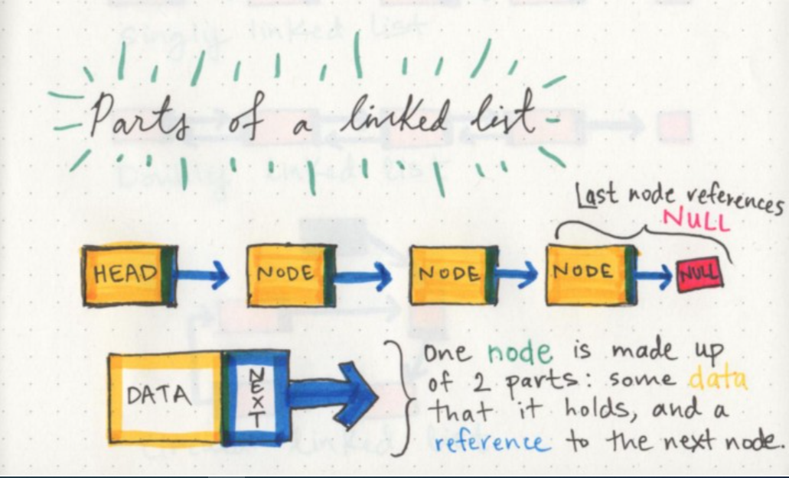
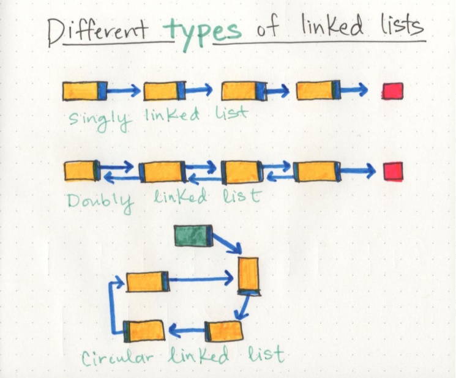
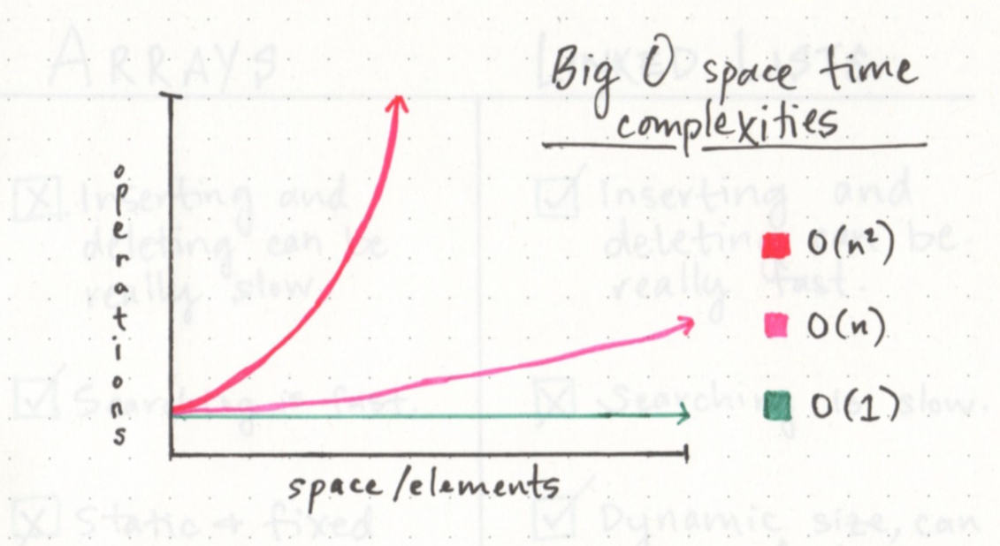
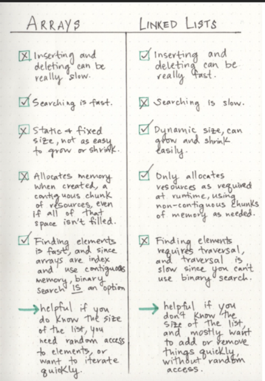

# Day 01
# What’s a Linked List, Anyway? [Part 1]

>## What is the linked list data structure, types, parts and so on.

there are a lot of ways to organize our information in software world, but the triky part is what is the best way we can use.

The first things that we encounter regardless of what language we use are **data structures**.

data structures: are the different ways that we can organize our data; variables, arrays, hashes, and objects are all types of data structures.

We will talk about linked list.

* Linear data structures:

One characteristic of linked lists is that they are linear data structures, which means that there is a sequence and an order to how they are constructed and traversed.

When we use arrays in our code, we’re implementing a linear data structure

What makes arrays and linked lists different?

1) Memory management

Memory allocation in static versus dynamic data structures

The fundamental difference between arrays and linked lists is that arrays are static data structures, while linked lists are dynamic data structures.

A dynamic data structure can shrink and grow in memory.

* Parts of a linked list

node: A single node is also pretty simple. It has just two parts: data, or the information that the node contains, and a reference to the next node.

* A node only knows about what data it contains, and who its neighbor is.

**And this is the very reason why a linked list doesn’t need a contiguous block of memory. Because a single node has the “address” or a reference to the next node, they don’t need to live right next to one another, the way that the elements have to in an array.**

Linked list called a doubly linked list, because there are two references contained within each node: a reference to the next node, as well as the previous node.

---

# What’s a Linked List, Anyway? [Part 2]

> ## A friendly intro to Big O Notation

* ### What is the Big O Notation?

It is a way of evaluating the performance of an algorithm.

There are two major points to consider when thinking about how an algorithm performs: how much time it requires at runtime given how much time and memory it needs.

* ### Example explain what is the benifit of Big O Notation

If we have a list of the number 1–10, and we wanted to write an algorithm that multiplied each number by 10, we’d think about how much time that algorithm would take to multiply ten numbers. But what if instead of ten numbers, we had ten thousand? Or a million? Or tens of millions? That’s exactly what Big O Notation takes into account: the speed and efficiency with which something functions when its input grows to be any (crazy big!) size.

 space and time complexity of an algorithm involve an O (referred to as just “O” or sometimes as “order”), and a variable n, where n is the size of the input.

* ### types of Big O equations:

1) O(1)

It takes constant time, which is to say that it doesn’t matter how many elements we have, or how huge our input is: it’ll always take the same amount of time and memory to run our algorithm.

2) O(n)

It is linear, which means that as our input grows (from ten numbers, to ten thousand, to ten million), the space and time that we need to run that algorithm grows linearly.

3) O($n^2$)

For a little contrast, we can also compare these two functions to something starkly different: an O(n²) function, which clearly takes exponentially more time and memory the more elements that you have. It’s pretty safe to say that we want to avoid O(n²) algorithms.

* ### Growing a linked list

Adding node in the first linked list:

1- First, we find the head node of 
the linked list.

2- Next, we’ll make our new node, and set its pointer to the current  first node of the list.

3- Lastly, we rearrange our head node’s pointer to point at our new node.

.png)

A good rule of thumb for remember the characteristics of linked lists is this:

> ### A linked list is usually efficient when it comes to adding and removing most elements, but can be very slow to search and find a single element.

### Finaly, the differance between Arrays and Linked lists:

> # Referances

1) https://medium.com/basecs/whats-a-linked-list-anyway-part-1-d8b7e6508b9d#.cik9aowxq

2) https://medium.com/basecs/whats-a-linked-list-anyway-part-2-131d96f71996 

