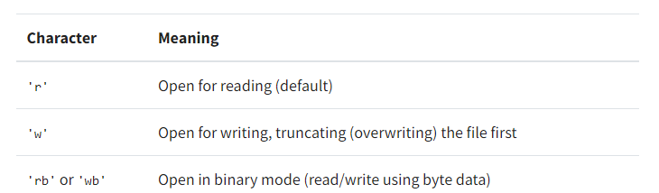
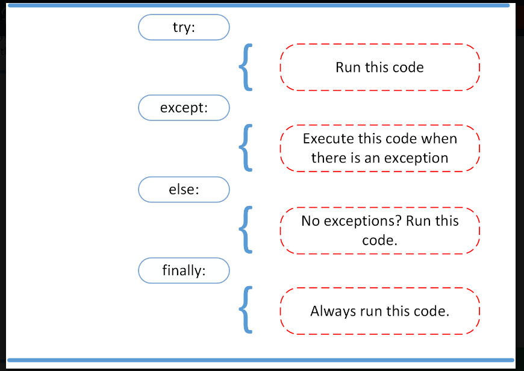

# Day 04
## Reading and Writing Files in Python

### What Is a File?

It is a contiguous set of bytes used to store data. This data is organized in a specific format and can be anything as simple as a text file or as complicated as a program executable. In the end, these byte files are then translated into binary 1 and 0 for easier processing by the computer.

Files on most modern file systems are composed of three main parts:

1- Header: metadata about the contents of the file (file name, size, type, and so on).

2- Data: contents of the file as written by the creator or editor.

3- End of file (EOF): special character that indicates the end of the file.

### ASCII vs Unicode:

The two most common encodings are the ASCII and UNICODE Formats. ASCII can only store 128 characters, while Unicode can contain up to 1,114,112 characters.

ASCII is actually a subset of Unicode (UTF-8), meaning that ASCII and Unicode share the same numerical to character values.

### Opening and Closing a File in Python:

1- open file:

>file = open('dog_breeds.txt')

2- close file: there is two way to close file:

>1- file.close()

>2- with open('dog_breeds.txt') as reader:

The with statement automatically takes care of closing the file once it leaves the with block, even in cases of error.

The second positional argument, mode. This argument is a string that contains multiple characters to represent how you want to open the file. The default and most common is 'r', which represents opening the file in read-only mode as a text file:

>with open('dog_breeds.txt', 'r') as reader:

### File objects

an object exposing a file-oriented API (with methods such as read() or write()) to an underlying resource.

There are three different categories of file objects:

* Text files
* Buffered binary files
* Raw binary files

## Python Exceptions: An Introduction

### Exceptions versus Syntax Errors

Syntax errors occur when the parser detects an incorrect statement.

### Raising an Exception:

We can use raise to throw an exception if a condition occurs. The statement can be complemented with a custom exception.

### The AssertionError Exception

Instead of waiting for a program to crash midway, you can also start by making an assertion in Python. We assert that a certain condition is met. If this condition turns out to be True, then that is excellent! The program can continue. If the condition turns out to be False, you can have the program throw an AssertionError exception.

### The try and except Block: Handling Exceptions

The try and except block in Python is used to catch and handle exceptions. Python executes code following the try statement as a “normal” part of the program. The code that follows the except statement is the program’s response to any exceptions in the preceding try clause.

### The else Clause

In Python, using the else statement, you can instruct a program to execute a certain block of code only in the absence of exceptions.

### Cleaning Up After Using finally

Imagine that you always had to implement some sort of action to clean up after executing your code. Python enables you to do so using the finally clause.

### Summing Up

* raise allows you to throw an exception at any time.
* assert enables you to verify if a certain condition is met and throw an exception if it isn’t.
* In the try clause, all statements are executed until an exception is encountered.
* except is used to catch and handle the exception(s) that are encountered in the try clause.
* else lets you code sections that should run only when no exceptions are encountered in the try clause.
* finally enables you to execute sections of code that should always run, with or without any previously encountered exceptions.

> ## Referances

1- https://realpython.com/read-write-files-python/#opening-and-closing-a-file-in-python

2- https://realpython.com/python-exceptions/
