# Day 05
## Classes and Objects

Objects are an encapsulation of variables and functions into a single entity. Objects get their variables and functions from classes. Classes are essentially a template to create your objects.

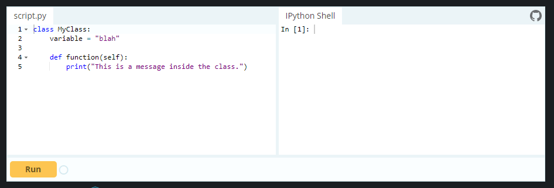

### Assign class to an object

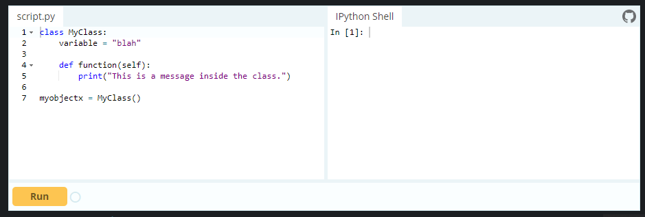

### Accessing Object Variables

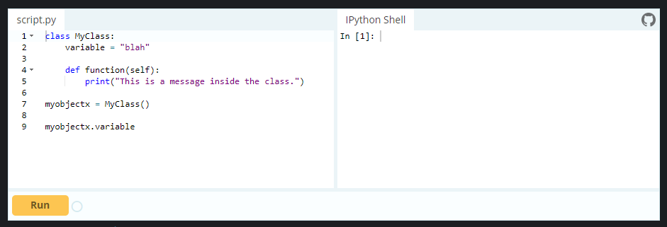
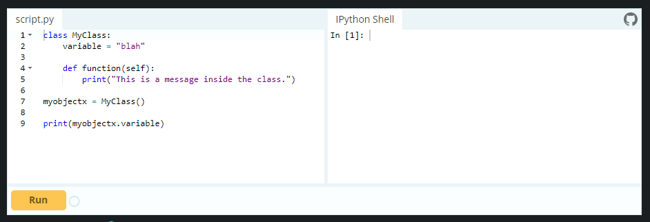

### Create multiple different objects

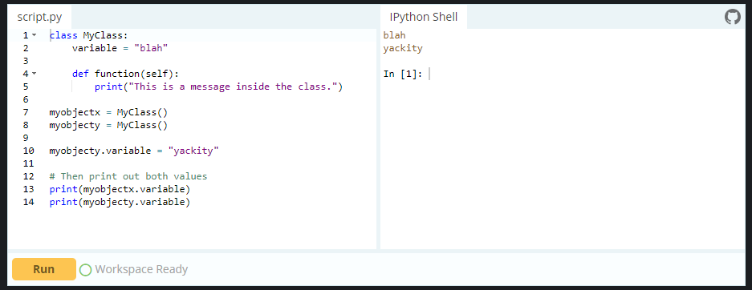

### Accessing Object Functions

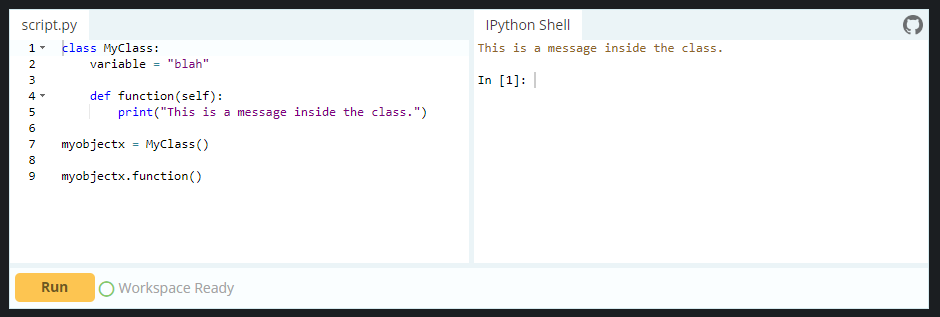

### init()

The __init__() function, is a special function that is called when the class is being initiated. It's used for assigning values in a class.

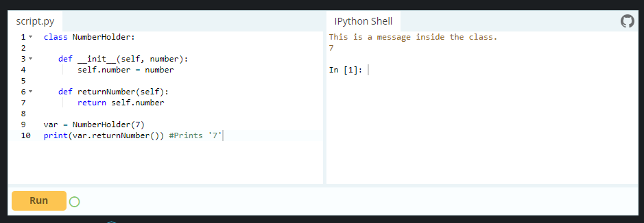

### Exercise

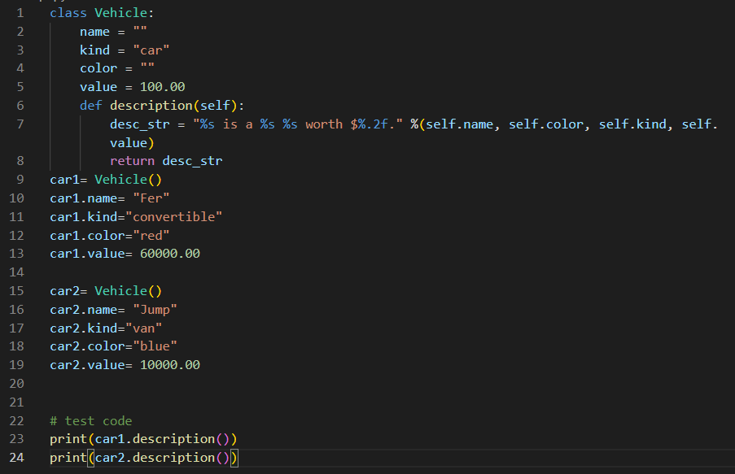
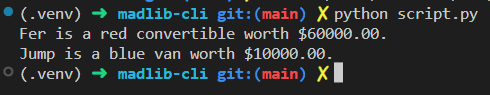

---

## Recursive Functions in Python

A recursive function is a function defined in terms of itself via self-referential expressions.

This means that the function will continue to call itself and repeat its behavior until some condition is met to return a result. All recursive functions share a common structure made up of two parts: base case and recursive case.

To demonstrate this structure, let’s write a recursive function for calculating n!:

1- Decompose the original problem into simpler instances of the same problem. This is the recursive case:

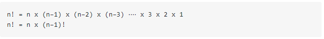

2- As the large problem is broken down into successively less complex ones, those subproblems must eventually become so simple that they can be solved without further subdivision. This is the base case:

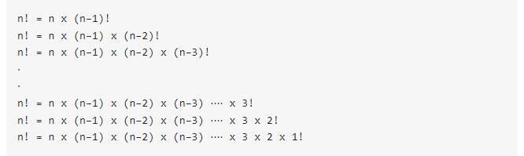

Here, 1! is our base case, and it equals 1.

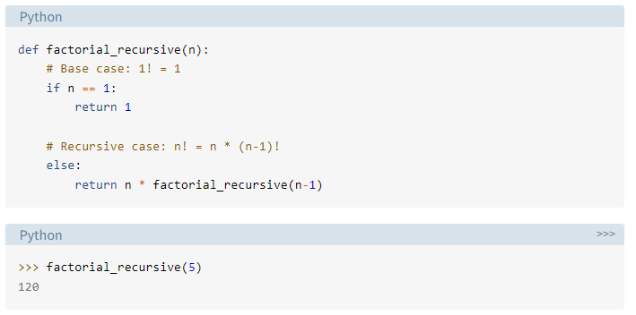

### Calculate summation from 1 t 10 by recrusion

Let’s calculate 1 + 2 + 3 ⋅⋅⋅⋅ + 10 using recursion. The state that we have to maintain is (current number we are adding accumulated sum till now).

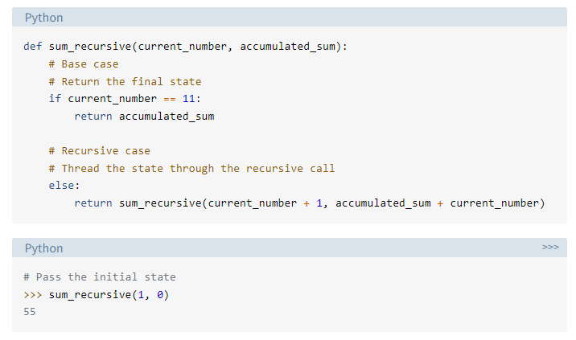

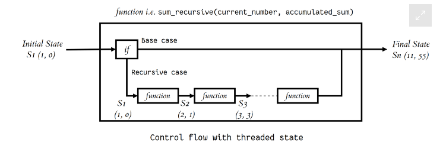

---

## Python Testing with pytest: Fixtures and Coverage

### Fixtures

When you're writing tests, you're rarely going to write just one or two. Rather, you're going to write an entire "test suite", with each test aiming to check a different path through your code. In many cases, this means you'll have a few tests with similar characteristics, something that pytest handles with "parametrized tests".

But in other cases, things are a bit more complex. You'll want to have some objects available to all of your tests. Those objects might contain data you want to share across tests, or they might involve the network or filesystem. These are often known as "fixtures" in the testing world, and they take a variety of different forms.

In pytest, you define fixtures using a combination of the pytest.fixture decorator, along with a function definition.

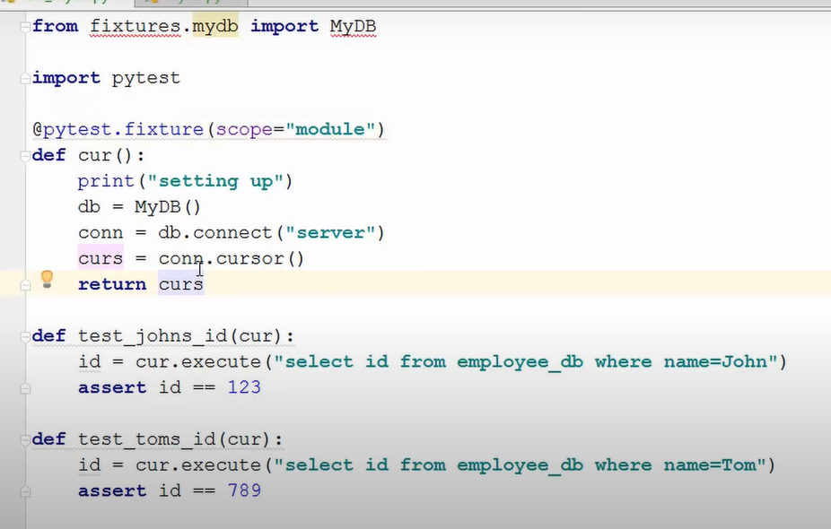