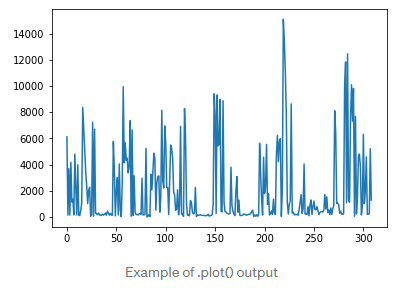
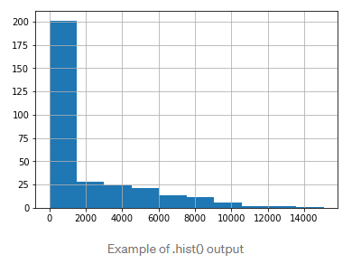

# Day 08
## Pandas for Data Science

Pandas is a game-changer for data science and analytics, particularly if you came to Python because you were searching for something more powerful than Excel and VBA. Pandas uses fast, flexible, and expressive data structures designed to make working with relational or labeled data both easy and intuitive.

pandas is like Excel in Python: it uses tables (namely DataFrame) and operates transformations on the data. But it can do a lot more.

### Import panda

`import pandas as pd`

### The most elementary functions of pandas

1- Reading data

`data = pd.read_csv('my_file.csv')`

`data = pd.read_csv('my_file.csv', sep=';', encoding='latin-1', nrows=1000, skiprows=[2,5])`

sep means separator. If you’re working with French data, csv separator in Excel is “;” so you need to explicit it. Encoding is set to “latin-1” to read French characters. nrows=1000 means reading the first 1000 rows. skiprows=[2,5] means you will remove the 2nd and 5th row when reading the file

2- Writing data

`data.to_csv('my_new_file.csv', index=None)`

index=None will simply write the data as it is. If you don’t write index=None, you’ll get an additional first column of 1,2,3, … until the last row.

3- Checking the data

`data.shape`

`data.describe()`

4- Seeing the data

`data.head(3)`

Print the first 3 rows of the data. Similarly to .head(), .tail() will look at the last rows of the data.

`data.loc[8]`

Print the 8th row

`data.loc[8, 'column_1']`

Print the value of the 8th row on “column_1”

`data.loc[range(4,6)]`

Subset from row 4 to 6 (excluded)

### The basic functions of pandas

1- Logical operations

`data[data['column_1']=='french']`

`data[(data['column_1']=='french') & (data['year_born']==1990)]`

`data[(data['column_1']=='french') & (data['year_born']==1990) & ~(data['city']=='London')]`

Subset the data thanks to logical operations. To use & (AND), ~ (NOT) and | (OR), you have to add “(“ and “)” before and after the logical operation.

2- Basic plotting

`data['column_numerical'].plot()`

`data['column_numerical'].hist()`

