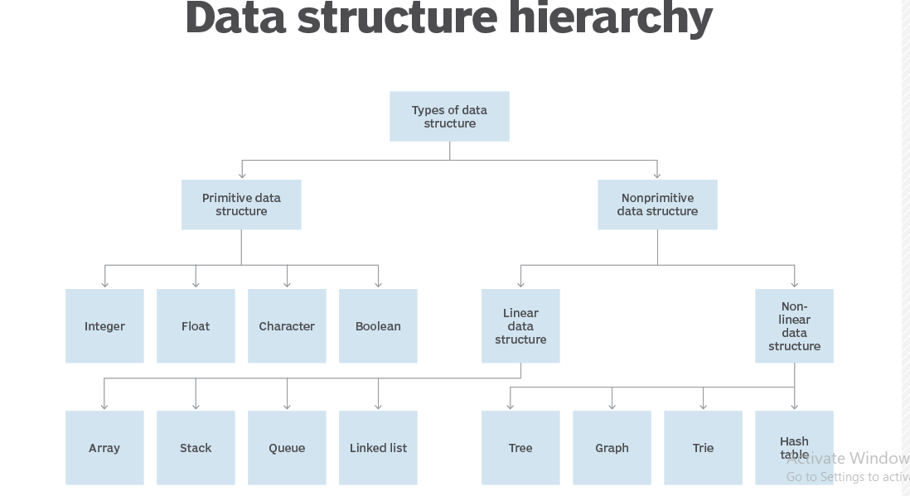
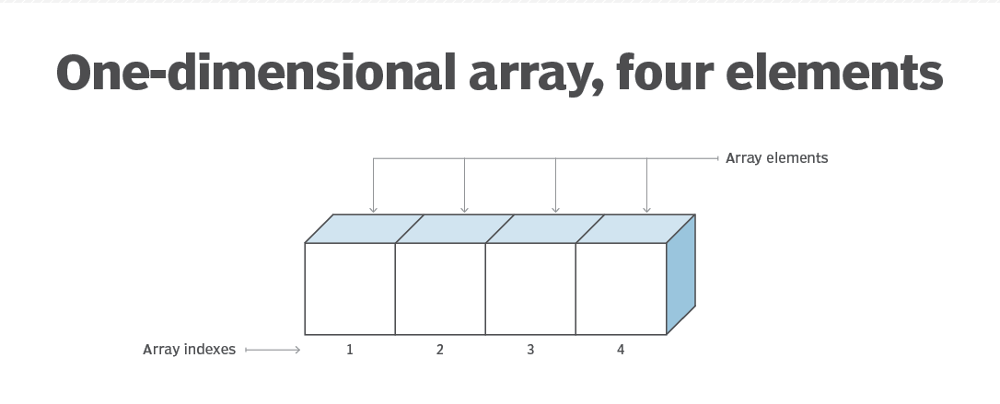
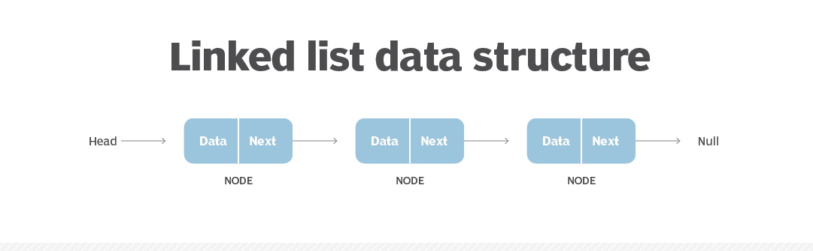
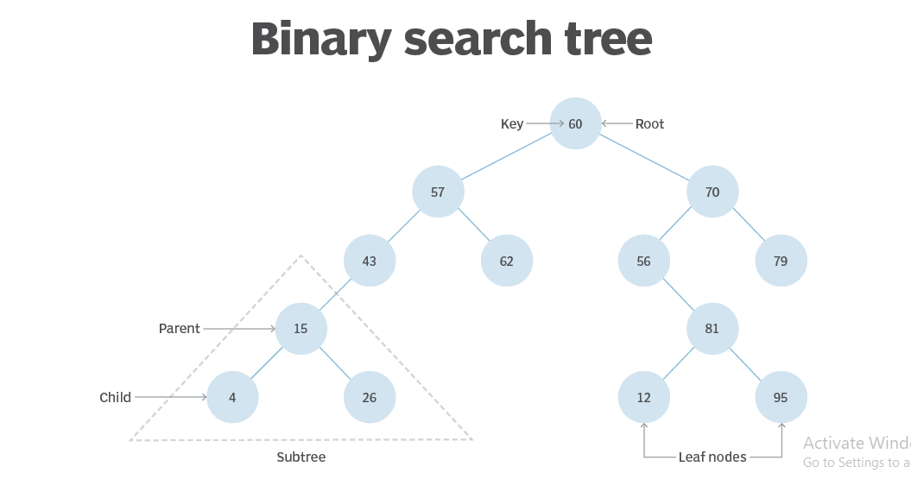
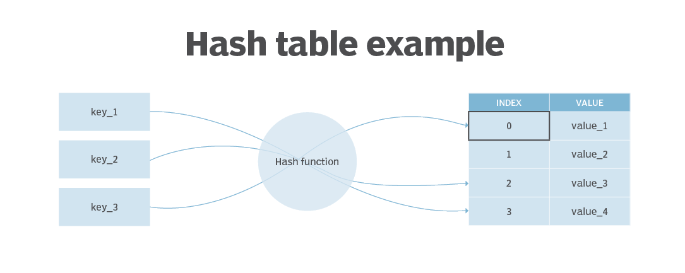

# Day 09
## LinkedList

### Data Structure

A data structure is a specialized format for organizing, processing, retrieving and storing data. There are several basic and advanced types of data structures, all designed to arrange data to suit a specific purpose. Data structures make it easy for users to access and work with the data they need in appropriate ways. 

In computer science and computer programming, a data structure may be selected or designed to store data for the purpose of using it with various algorithms.

For instance, in an object-oriented programming language, the data structure and its associated methods are bound together as part of a class definition.

### Why are data structures important?

Data structures are the building blocks for more sophisticated applications. They are designed by composing data elements into a logical unit representing an abstract data type that has relevance to the algorithm or application. An example of an abstract data type is a "customer name" that is composed of the character strings for "first name," "middle name" and "last name."

It is not only important to use data structures, but it is also important to choose the proper data structure for each task. Choosing an ill-suited data structure could result in slow runtimes or unresponsive code. 

### Five factors to consider when picking a data structure include the following:

1- What kind of information will be stored?

2- How will that information be used?

3- Where should data persist, or be kept, after it is created?

4- What is the best way to organize the data?

5- What aspects of memory and storage reservation management should be considered?

### How are data structures used?

In general, data structures are used to implement the physical forms of abstract data types. Data structures are a crucial part of designing efficient software. They also play a critical role in algorithm design and how those algorithms are used within computer programs.

Today, many programming languages include an extensive collection of built-in data structures to organize code and information. For example, Python lists and dictionaries, and JavaScript arrays and objects are common coding structures used for storing and retrieving information.

### Characteristics of data structures

1- Linear or non-linear.

2- Homogeneous or heterogeneous.

3- Static or dynamic.

### Types of data structures

1- Array. An array stores a collection of items at adjoining memory locations. Items that are the same type are stored together so the position of each element can be calculated or retrieved easily by an index. Arrays can be fixed or flexible in length.

2- Stack. A stack stores a collection of items in the linear order that operations are applied. This order could be last in, first out (LIFO) or first in, first out (FIFO).

3- Queue. A queue stores a collection of items like a stack; however, the operation order can only be first in, first out.

4- Linked list. A linked list stores a collection of items in a linear order. Each element, or node, in a linked list contains a data item, as well as a reference, or link, to the next item in the list.

5- Tree. A tree stores a collection of items in an abstract, hierarchical way. Each node is associated with a key value, with parent nodes linked to child nodes -- or subnodes. There is one root node that is the ancestor of all the nodes in the tree.

6- Heap. A heap is a tree-based structure in which each parent node's associated key value is greater than or equal to the key values of any of its children's key values.

7- Graph. A graph stores a collection of items in a nonlinear fashion. Graphs are made up of a finite set of nodes, also known as vertices, and lines that connect them, also known as edges. These are useful for representing real-world systems such as computer networks.

8- Trie. A trie, also known as a keyword tree, is a data structure that stores strings as data items that can be organized in a visual graph.

9- Hash table. A hash table -- also known as a hash map -- stores a collection of items in an associative array that plots keys to values. A hash table uses a hash function to convert an index into an array of buckets that contain the desired data item.

---
## Data Structure and Algorithms - Linked List

A linked list is a sequence of data structures, which are connected together via links.

Linked List is a sequence of links which contains items. Each link contains a connection to another link. Linked list is the second most-used data structure after array.

### important terms

1- Link − Each link of a linked list can store a data called an element.

2- Next − Each link of a linked list contains a link to the next link called Next.

3- LinkedList − A Linked List contains the connection link to the first link called First.

### Types of Linked List

1- Simple Linked List − Item navigation is forward only.

2- Doubly Linked List − Items can be navigated forward and backward.

3- Circular Linked List − Last item contains link of the first element as next and the first element has a link to the last element as previous.

### Basic Operations

1- Insertion − Adds an element at the beginning of the list.

2- Deletion − Deletes an element at the beginning of the list.

3- Display − Displays the complete list.

4- Search − Searches an element using the given key.

5- Delete − Deletes an element using the given key.

> ## Referances

1- https://www.techtarget.com/searchdatamanagement/definition/data-structure#:~:text=A%20data%20structure%20is%20a,they%20need%20in%20appropriate%20ways.

2- https://www.tutorialspoint.com/data_structures_algorithms/linked_list_algorithms.htm